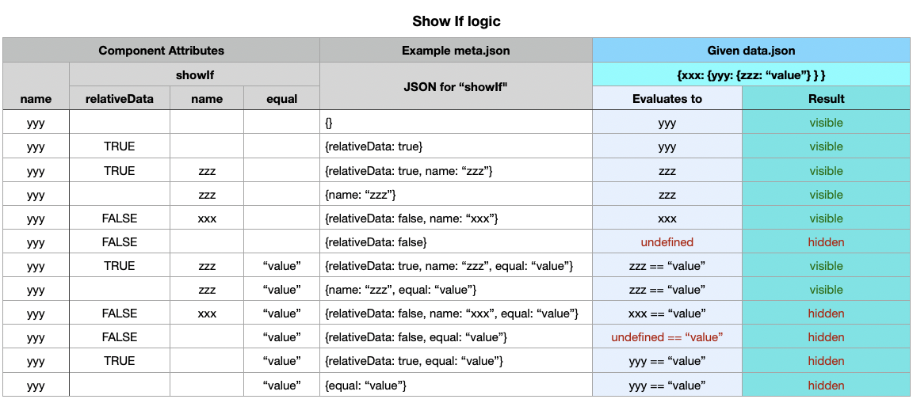

### Table of Contents

## The Pattern Driven Design

The UI Render takes a conceptually different approach from most UI frameworks you may be familiar with (ex. Bootstrap,
Material Design, Ant Design...).

Like most frameworks, it has `built-in UI components`, such as Button, Table, Dropdown, etc. - with different set of
attributes available for each.

However, instead of being limited to what built-in components can do, you have complete freedom to mix them in any way
you like. Similar to building something from Lego.

The freedom of configuration comes from UI Render's `transform patterns`.
These patterns allow you to turn static `meta.json` files into dynamic configurations, by transforming attributes on the
fly.

In short, the UI Render is both declarative and dynamic in nature, with the possibility of `unlimited customisation`.

## Transform Patterns

1. **Recursive Field definition**
  - A Field can be any component, identified by `view` attribute, such as: Row, Button, Table, Dropdown, Piechart...
  - Objects with `view` attribute can have other Fields nested inside `items` attribute.

2. **Dynamic State**
  - Besides `data.json`, you can use dynamic `state` when configuring `meta.json`
  - You can create new or update existing state using `functions` (see point 8):
    Example of setting active plan using `onChange` function: `"onChange": "setState,plan"`
  - To read the state, define `name` attribute with key path like this:
    `"name": "plan.{state.plan,0}"` (next point explains how this works)
  - For advanced config, see the [example](#component-attributes) of Dropdown `onChange` attribute

3. **Curly Brace Transform**
  - The curly brace surrounding a key path will replace it with value found in `data.json` or in `state`
    Example: `"name": "plan.{state.plan}.title"` -> becomes `"name": "plan.undefined.title"`
  - Fallback value can be defined after a comma, to avoid `undefined` value on initialization
    Example: `"name": "plan.{state.plan,0}.title"` -> falls back to `"name": "plan.0.title"`

4. **Value Transform (for objects with a single attribute "name" and optional "relativeData")**
  - Example: `"title": { "name": "{key}" }` -> becomes `"title": "relative value"`
  - Example: `"title": { "name": "{key}", relativeData: false }` -> becomes `"title": "root value"`
  - Curly brace transform of the `{key}` attribute will happen first in above examples
  - See point 7 for the explanation of how `relativeData` works

5. **Data Mapping (by key paths)**
  - Use this to link attributes within `data.json` or `state` to attributes required by the component
  - You can define data mappers as object or string:
    a) `Object` example: `"mapOptions": {"component.attribute": "data.or.state.key.path"}`
    b) `String` example: `"mapOptions": "planName"` -> use `planName` attribute as options value
  - See the [example](#component-attributes) of `mapItems` and `mapOptions`

6. **Custom Rendering (by matching values)**
  - See the [example](#component-attributes) of `renderCell: { values: {...} }` in Table view
  - Default function can be defined when no value matches
    Example: `"renderCell": { "default": "Currency" }`

7. **Relative Data**
  - When you specify the `name` attribute of a Field, it retrieves values from local `data.json` object by default
  - Local Data is passed down (inherited) from parent/grandparent/etc. fields.
  - Use `{"relativeData": false}` to make `name` attribute retrieve values from global (root `data.json`)
  - Example:
    ```js
    const localData = {
      view: "GrandParent",
      name: "path.to.item.0",
      items: [
        {
          view: "Parent",
          name: "plan.0", // => this will resolve to "root.path.to.item.0.plan.0"
          items: [
            {
              view: "Child",
              name: "id", // => this will resolve to "root.path.to.item.0.plan.0.id"
            },
            {
              view: "Child",
              name: "id", // => this will resolve to "root.path.to.item.0.plan.0.id"
              relativeData: true,
            },
            {
              view: "Child",
              name: "id", // => this will resolve to "root.id"
              relativeData: false,
            }
          ]
        }
      ]
    }
    ```

8. **Function definitions**
  - A Function gives you a way to format data for display in the UI (ex. `Currency`, `Float`, `Percent`...)
  - A Function can be defined using `['onClick', 'onChange', 'onDone']` attributes, or starting with the word `render`
    Example: `renderLabel`, `renderCell`...
  - Function can be defined as `String`, with arguments separated by comma/s
    Example: `"setState,plan"` -> use `setSate` function with `plan` as argument
  - Function can be defined as `Object`
    Example:
    ```js
      {
        name: "fetch",
        args: [
          "https://url.to.fetch.com/api",
          {
            method: "POST",
            ...
          }
        ]
      }
    ```
  - Functions can perform complex UI logic by chaining with nested definitions.
    However, this requires coding skills. It is better to ask a developer (if you are not) for such cases.
    Example:
    ```js
      {
        name: "fetch",
        onDone: {
          name: 'fetch',
          mapArgs: [ // function will first receive `mapArgs`, then followed by `args`, as arguments
            // variable `{0.payload.ip}` can be defined to get data from arguments, in addition to *_data.json
            'https://ipapi.co/{0.payload.ip}/json', // this is the first argument passed to the function
            // ...second (subsequent) argument/s can be defined as object/array/number/etc.
          ],
          onDone: {
            name: 'popup',
            args: ['Dropdown.onChange\n -> fetch(IpAddress).onDone\n -> fetch(GeoData).onDone\n -> popup'],
          }
        }
      }
    ```

## Component Attributes

### Root Level

```js
{
  currencyCode: 'USD', // default currency code for displaying currency symbol
                       // Supported codes: 'USD', 'EUR', 'GBP'
}
```

### Common Attributes

Available in all UI components:

```js
{
  view: 'Col',           // (required) name of the React Component used to display this field
  items: [],             // recursively nested fields
  children: 'Any',       // nested content to render inside field
  onClick: Function,     // ex: {onClick: 'setState,active.plan'}
  style: Object,         // CSS style to apply
  className: 'string',   // CSS class name to apply
  debug: Boolean,        // suppress certain errors related to incorrect data type
  showIf: "path.to.data.that.exists",  // render only if path resolves to truthy value
  showIf: {              // object notation
    name: "path.to.data.that.exists",
    relativeData: Boolean,
    equal: Any,          // value to match against
  },
}
```

### Input Attributes

```js
{
  name: 'adminCosts.adminCategory', // (required) path to field value within data.json
  label: 'Input label',
  placeholder: 'Appears inside empty input when focused',
  type: 'number',       // 'checkbox', 'email', 'number', 'select', 'slider', 'text', 'textarea', 'toggle', etc.
  icon: 'dollar',       // icon css class name
  lefty: Boolean,        // show icon on the left (default: right)
  float: Boolean,        // label floats above input when focused
  disabled: Boolean,
  readonly: Boolean,     // makes all nested fields disabled with readonly CSS class
  removable: Boolean,    // show cross icon that sets input value to null
  format: String,        // name of the format function
  normalize: String,     // name of the normalizer function
  parse: String,         // name of the parser function
  validate: String,      // name of the validation function
  value: undefined,      // controlled input value
  defaultValue: undefined, // used on init if value not set
  onChange: String,       // callback function name for input value changes
  min: Number,
  max: Number,
  hint: 'Title text above input',
  info: 'Content rendered when input is in focus',
  error: 'Content rendered when input is invalid',
  autoSubmit: Boolean,   // submit form on changes
  autoSubmit: {          // with customized options
    delay: Number,       // delay in ms, default 200
  },
  outputFormat: {        // for Inputs with type 'number'
    decimals: Number,    // fractional digits to show
    percentage: Boolean, // add percent sign
    separateThousands: Boolean, // separate thousands (not compatible with percentage)
  },
}
```

### Dropdown / Select Attributes

`Select` is used for changing Input values, `Dropdown` for changing UI state only.
Both support `{state.xxx}` interpolation — when a value is selected, it updates `state` automatically,
so dependent fields using `{state.fieldName,fallback}` in their paths will re-render with new data.

```js
{
  compact: Boolean,
  multiple: Boolean,
  search: Boolean,       // searchable options
  options: [{ text: 'Label', value: 'internal value' }],
  mapOptions: Object,    // data mapper (ex: {value: "{index}", text: "planName"})
  // Note: mapOptions.value = "{index}" stores selected value as String index.
  // Use a persistent key (e.g. mapOptions.value = "id") to keep value stable.
  value: { name: '{state.active.plan,0}' }, // dynamic config using state
  onChange: {
    name: 'setState',
    args: ['active.plan'],
  },
}
```

#### Select with Dynamic State (Cascading Selects)

Select fields now support `{state.xxx}` path interpolation, enabling cascading dependencies.
When a Select value changes, it automatically updates `state`, so dependent fields re-render.

Example: Category selection drives Product options:
```json
{
  "view": "Select",
  "name": "categoryX",
  "options": { "name": "Catalog.Categories", "relativeData": false },
  "mapOptions": { "text": "CategoryName", "value": "{index}" },
  "compact": true
}
```
Dependent Product Select uses `{state.categoryX,0}` to resolve the active category:
```json
{
  "view": "Select",
  "name": "productX",
  "options": {
    "name": "Catalog.Categories.{state.categoryX,0}.Products",
    "relativeData": false
  },
  "mapOptions": "Product",
  "compact": true
}
```

See the [Select: Cascading](#selectCascading) example for a working demo.

#### mapOptions — How Select Values Are Stored

`mapOptions` controls which data field is displayed as option text and what value is stored when the user makes a selection. The stored value affects form data on submit.

**Index-based (default)** — stores the position index of the selected option:

```json
"mapOptions": "categoryName"
```
Shorthand for `{ "text": "categoryName", "value": "{index}" }`.
Selected value in form data: `"0"`, `"1"`, etc.
On submit, `changeOptionOrderForSelectFields` moves the selected item to the front of the options array and **removes** the select field from the output data.

```json
"mapOptions": { "text": "categoryName", "value": "{index}" }
```
Explicit index-based — same behavior as the shorthand above.

**Stable value** — stores the actual data field value:

```json
"mapOptions": { "text": "categoryName", "value": "categoryCode" }
```
Selected value in form data: `"TECH"`, `"DESIGN"`, etc. (actual `categoryCode` values).
The select field **stays** in the output data with the real value. Options array is **not** reordered.

**When to use which:**

| Scenario | mapOptions | Stored value | Kept in output |
|---|---|---|---|
| UI state only (drive other fields via `{state.xxx}`) | `"fieldName"` or `{ text, value: "{index}" }` | Index (`"0"`) | No (removed on submit) |
| Persistent selection (value matters for backend) | `{ text: "label", value: "id" }` | Real value (`"HIGH"`) | Yes |

**Example: stable-value Select**

data.json:
```json
{
  "periodBasis": [
    { "periodBasisType": "Month" },
    { "periodBasisType": "Year" }
  ]
}
```

meta.json (index-based — default):
```json
{
  "view": "Select",
  "name": "periodBasisSelection",
  "options": { "name": "periodBasis" },
  "mapOptions": "periodBasisType"
}
```
→ Stores `"0"` or `"1"`. Removed from output on submit.

meta.json (stable-value):
```json
{
  "view": "Select",
  "name": "periodBasisSelection",
  "options": { "name": "periodBasis" },
  "mapOptions": { "text": "periodBasisType", "value": "periodBasisType" }
}
```
→ Stores `"Month"` or `"Year"`. Kept in output data.

### Slider Attributes

```js
{
  step: Number,          // slider increment
  pushable: Number,      // minimum increments between two handles
}
```

### Table Attributes

```js
{
  inverted: Boolean,     // dark mode
  striped: Boolean,      // alternate background shade
  vertical: Boolean,     // render rows as columns (not compatible with renderItem)
  headers: [
    {
      id: String,        // required cell id
      label: String || Number || { name: String },
      renderCell: String || Object,
    },
    {
      id: String,
      label: String || Number || { name: String },
      renderCell: {      // dynamic rendering based on cell value
        values: { 'value to match': { /* nested field definition */ } },
        default: String,
      },
    },
  ],
  extraHeaders: [        // additional header layers rendered above headers
    [
      { colSpan: 2, label: String || Number || { name: String } },
    ],
  ],
  extraItems: [          // additional row definitions
    {
      'cellId1': String,
      'cellId2': { name: 'path.to.cell.value' },
      'cellId3': { render: 'Currency', name: 'path.to.cell.value' },
      'cellId4': { view: 'Input', name: 'path.to.cell.value' },
    },
  ],
  renderItem: Object,    // nested field definition rendered after each Table item
  filterItems: [         // for nested tables within tables
    { 'state': 'state' },
  ],
  group: {               // matrix table data grouping
    by: { id: 'tier', label: Object },
    header: { id: 'ageBand' },
  },
  itemsExpanded: Boolean, // expand all rows by default
  itemClassNames: [      // conditional class names for table items
    { id: String, values: { 'value to match': 'className' } },
  ],
  sorts: [               // sorting icon in table headers
    { id: String, order: 0, sortKey: 'item.attribute' },
  ],
  colGroup: [            // column styles (colgroup HTML element)
    { style: Object, isFixed: Boolean },
  ],
  usePagination: false,  // enable pagination
  rowsPerPage: 20,       // rows per page
}
```

### Pie Chart Attributes

```js
{
  mapItems: Object,      // data mapper (ex: {label: 'pieLabelKey', value: 'pieValueKey'})
}
```

### Upload Attributes

```js
{
  kind: 'Type of file, e.g. "images"',
  count: Number,         // number of files/inputs
}
```

### AutoSubmit Attributes

```js
{
  delay: Number,         // delay in ms, default 200
  partial: true,         // submit only changed values
}
```

For a full list of values to use for `view` and formatting functions,
check [Field Definitions](https://github.com/ecoinomist/modules-pack/blob/master/src/variables/fields.js)
and [Form Input Definitions](https://github.com/ecoinomist/modules-pack/blob/master/src/form/constants.js).

## Popup Component

The Popup component allows you to display modal dialogs with form fields. When used with Tables, popup fields automatically receive the correct `relativePath` and `relativeIndex` to ensure form field names match the table row that opened the popup.

### Basic Usage

```js
{
  view: 'Button',
  children: 'Open Popup',
  onClick: {
    name: 'popupOpen',
    args: ['popupId']
  }
},
{
  view: 'Popup',
  id: 'popupId',
  items: [
    {
      view: 'Input',
      name: 'fieldName',
      label: 'Field Label'
    }
  ]
}
```

### Using Popups with Tables

When opening a popup from a table row (using `renderItem`), the popup fields will automatically use the correct table row context. This ensures that input field names include the proper path and index.

**Example: Opening popup from table row**

```js
{
  view: 'Table',
  name: 'experienceRatingInputs.uwOverridesCoverage',
  headers: [
    { id: 'coverageType', label: 'Coverage Type' }
  ],
  renderItem: {
    view: 'VerticalLayout',
    items: [
      {
        view: 'Button',
        children: 'Override',
        onClick: {
          name: 'popupOpen',
          args: ['InforceRateOverrideReason.{index}']
        }
      },
      {
        view: 'Popup',
        id: 'InforceRateOverrideReason.{index}',
        items: [
          {
            view: 'Input',
            name: 'inforceRateOverride',
            // Becomes: "experienceRatingInputs.uwOverridesCoverage[0].inforceRateOverride"
            type: 'number',
            label: 'Inforce Rate Override'
          },
          {
            view: 'Input',
            name: 'inforceRateOverrideReason',
            label: 'Reason'
          }
        ]
      }
    ]
  }
}
```

### How It Works

1. **Popup ID with Template Variables**: Use `{index}` in the popup ID to create unique popups per row.

2. **Automatic Context Passing**: When a popup is opened from a table row, `relativePath` and `relativeIndex` are automatically passed to popup fields. Input field names are prefixed with the full path: `"{relativePath}[{relativeIndex}].{fieldName}"`.

3. **Form Field Names**: Each table row gets its own set of popup fields with correct path associations and independent validation.

### Important Notes

- Use `{index}` in the popup ID when opening from table rows
- Input fields inside popups automatically get the correct path prefix
- Popup fields receive the current row's data (`_data`) automatically
- Popups are centered on screen

## ShowIf Logic


