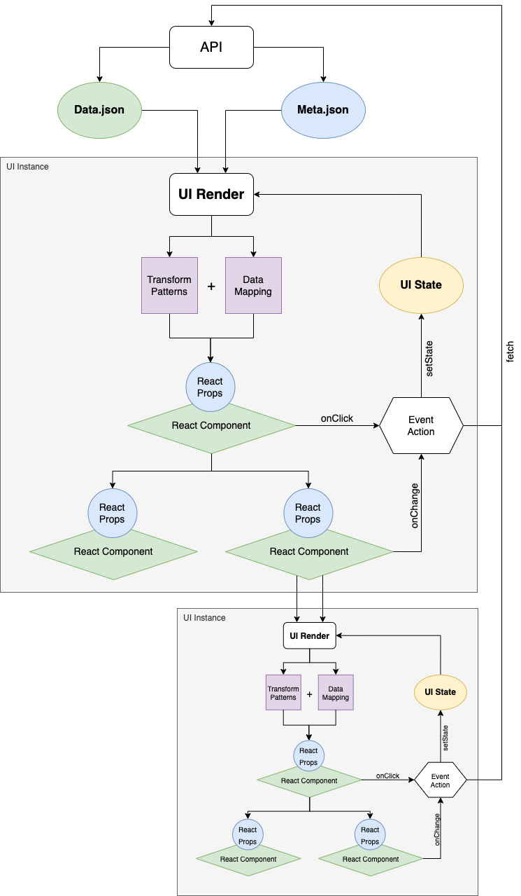

# UI Render Architecture

The UI Render uses a unidirectional data flow, with recursively nested React components and UI instances within these
components (called `Data` components).

The diagram below illustrates this nested architecture:

Inherently, UI Render does not have any structured data.

All it does, is take a source of data from `data.json` and configuration from `meta.json`, then parse it though
predefined `Transform Patterns` to map data with configuration and produce attributes (`props`) ready for React
components consumption.

Events triggered from React components can fire predefined `actions` that will either update the UI Render instance's
state, or call `API` to refetch/update data.json and/or meta.json.

This UI state or API update causes UI Render to recompute `props` for React components, resulting in rerendering only
for those React components that have changed props.

The cycle repeats every time there is an `action` causing UI state or API update.

