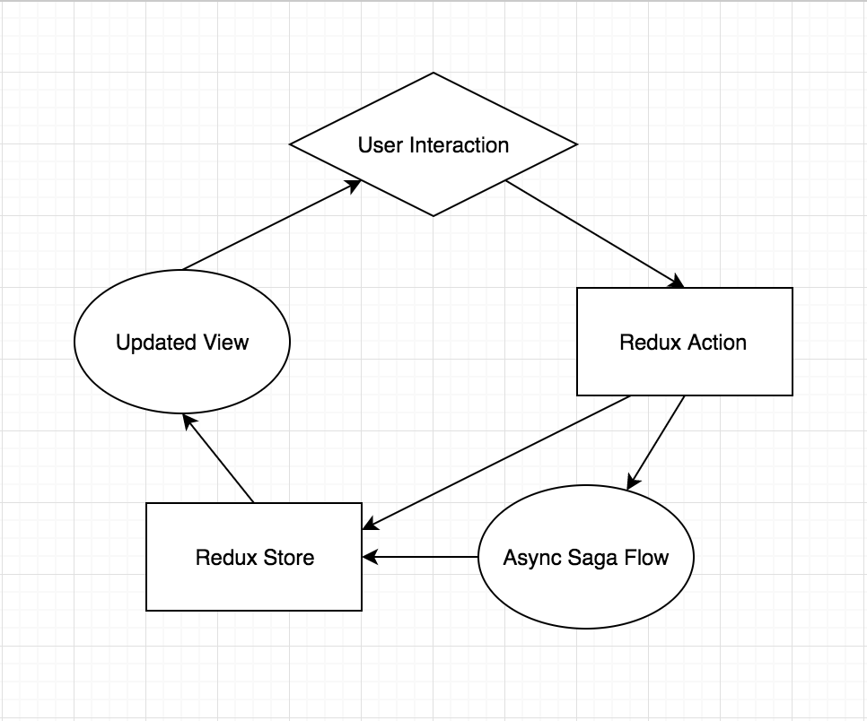

# Application Overview

## Table of Content
* [Architecture](#architecture)
* [CSS Overview](#css-overview)
* [Post-Processing CSS](#post-processing-css)
* [Why is Flexbox model chosen for CSS?](#why-is-flexbox-model-chosen-for-css)
* [What is the “modular” design pattern and why was it chosen?](#what-is-the-modular-design-pattern-and-why-was-it-chosen)
* [How do the modules connect to one another?](#how-do-the-modules-connect-to-one-another)
* [What is the difference between "modules" and "Containers"?](#what-is-the-difference-between-modules-and-containers)
* [How are Redux actions grouped and structured?](#how-are-redux-actions-grouped-and-structured)
* [How are async tasks handled, how is Redux Saga used in the app?](#how-are-async-tasks-handled-how-is-redux-saga-used-in-the-app)
* [What is action composition and how is it handled in the application?](#what-is-action-composition-and-how-is-it-handled-in-the-application)
* [Examples](#examples)
  * [How to dispatch a Redux action?](#how-to-dispatch-a-redux-action)
  * [How to create a new Saga for an async task?](#how-to-create-a-new-saga-for-an-async-task)     

## Architecture



This app is built using **unidirectional** data flow with **modular** architecture and **functional programming** paradigm, where each set of closely related features are grouped into individual self-containing folders (called modules), that perform specific tasks within the app.

The app is divided into **common** and **app-specific modules**. Common modules are used by many app-specific modules to delegate common tasks, like API fetching, form inputs, etc.

Examples of common modules include: [api](../repos/core/src/common/api), [redux](../repos/core/src/common/redux) and [utils](../repos/core/src/common/utils).

Examples of app-specific modules include: [tracking](../repos/core/src/modules/tracking) and [user](../repos/core/src/modules/user).

Every interaction that happens within the app is dispatched as an **action** ([redux-action](https://redux.js.org/basics/actions)), and action orchestration (interaction flow) is managed with reactive action-subscription pattern (chaining of events) using ES6 generator functions ([redux-saga](https://github.com/redux-saga/redux-saga)). This allows us to declaratively compose complex asynchronous flows into easy to understand work flows.

The best way to understand how the app works is to open it in development mode, by running `yarn start`, wait for it to load, and then open Chrome developer tool, and watch the `Console` tab while interacting with the app. You can also watch actions being fired through the `Redux` tab after installing [redux chrome extension](https://chrome.google.com/webstore/detail/redux-devtools/lmhkpmbekcpmknklioeibfkpmmfibljd?hl=en).

Like playing with LEGO, we always break down features into the smallest possible units of re-usable [pure functions](https://en.wikipedia.org/wiki/Pure_function), group them together into modules, then compose those functions and modules to achieve the end result. Example of pure functions in the app can be found in the common utilities module `src/common/utils`.

## CSS Overview

Like the modular approach to data architecture, CSS styling is done in similar fashion. There is a very strong emphasis on re-use by separating CSS styles into individual components that can be composed together to create complex views.

All CSS files for the web build are inside the [style](../repos/web/style) folder, with the root file [_all.less](../repos/web/style/_all.less). Please check all the comments inside [_variables.less](../repos/web/style/_variables.less) for conventions we use.

You should see clear separation of concerns when it comes to styling generic vs app-specific components.

For example, common components like [modal](../repos/web/style/modal.less) and [layouts](../repos/web/style/_layout.less), which are almost identical in many projects, do not have any app specific styling. 
These common styling are re-used and composed together to create app-specific styling for the [menu](../repos/web/style/menu.less) with the use of LESS [:extend()](http://lesscss.org/features/#extend-feature-use-cases-for-extend) keyword.

These way we can easily copy-paste tested and proven to be cross-browser compatible components like modals without wasting weeks of development time.

CSS can also be re-used by adding their class names directly in React components (ex.` <Button className='primary other-css-classes'>...`).

Lastly, a typical CSS module would have all of its variables defined at the top, prefixed with the module's name to avoid name collision (ex. `src/web/style/input.less`).

## Post-Processing CSS

This project setup minifies your CSS (on production build only) and adds vendor prefixes automatically through [Autoprefixer](https://github.com/less/less-plugin-autoprefix).

For example, this:

```css
.app {
  display: flex;
}
```

turns into this, once compiled:

```css
.app {
  display: -webkit-box;
  display: -ms-flexbox;
  display: flex;
}
```

## Why is Flexbox model chosen for CSS?
Everything in the app is styled with flex-box, and we need to avoid using CSS floats, as well as other forms of displays, such as grid, table, block, etc. This is because it makes it easier to distribute the app on other platforms in the future, like mobile (using React Native, which only allows flexbox) and native desktop environments.

## What is the “modular” design pattern and why was it chosen?
A module in the app is a stand-alone collection of all necessary functions and constants that are designed to deliver certain features. It should be composable for re-use by simply copy-pasting to another project with little to no modification (except for correcting missing imports).

A typical module file structure:
```
├ module
    ├ __mock__
    |   ├ data.js
    |   ├ store.js
    ├ __tests__
    |   ├ reducers.test.js
    |   ├ sagas.test.js
    |   ├ utils.test.js
    ├ _View.js  # view template of the module
    ├ constant.js  # action constant definitions
    ├ data.js  # initial state of the app
    ├ index.js  # module’s export file
    ├ reducers.js  # business logic to update app state from actions
    ├ sagas.js  # action orchestration
    ├ selectors.js  # app state queries (similar to database query)
    ├ utils.js  # helper functions
```
There is a boilerplate [_template](../repos/core/src/_template) you can use when creating new modules.

For example, the `api` module is solely responsible for performing network requests to the backend REST API. This module handles all HTTP fetch requests, as well as timeout and error handling. It’s also responsible for storing and requesting new authentication token when expired, as well as the login and the logout flow of the application. What the `api` module does not do is defining the different endpoints of the backend API, it just knows how to fetch them when URLs are provided, because these data are project specific.

The modular design pattern was chosen because it allows us to easily add new features overtime while following the best programming principles:

* Don’t Repeat Yourself (DRY)
* Composition Over Inheritance
* Separation of Concerns
* Single Responsibility Principle (SRP)
* Single Source of Truth (SSOT).

This allows us to focus 80% of the time on actual development, and only 10-20% of the time on fixing bugs, not the other way around 😎.

## How do the modules connect to one another?

Modules connect to each other through:

1. [Containers](../repos/core/src/containers) - Views composed from other modules
2. [Pages](../repos/core/src/pages) - Routes composed of Container Views to create a complete UI Page/Screen
3. Root - top level file connecting all Pages/Screens together (example: `repos/web/src/main.js`)
4. Action orchestration (managed by redux-saga in `sagas.js` files).

## What is the difference between "modules" and "Containers"?

The commonality:

* Used for encapsulating similar functionality into reusable chunks

The difference:

* a Module is a collection of self-containing functions for performing a specific task (ex. [router](../repos/core/src/modules/router) module for handling all navigation logic)
* a Container composes related tasks (modules) together to deliver a re-usable feature-set (ex. [NavLinks](../repos/core/src/containers/NavLinks.js) renders a list of links using Router module and AlertCounter component, which can be used as Header and/or Sidebar links).

This very subtle but important distinction allows us to easily extend and keep adding new feature-sets into the app without the fear of breaking existing features, thus reducing the need for regression testing.

## How are Redux actions grouped and structured?

All redux action handling is written inside `reducers.js` files, and are grouped into modules they belong to. Each module only has access to its own Redux store branch, and is only able to update that branch of the store. This is done to prevent different modules from interfering with each other's business. 
We use the [redux-actions](https://github.com/redux-utilities/redux-actions) library for this purpose.

However, the Redux actions themselves can be dispatched from anywhere in the app. Two most common places to fire Redux actions are:

* Containers - beside composing different modules, Containers usually handle the mapping of User interactions to Redux actions that get called (actions are declared by `mapDispatchToProps`)
* Sagas - `sagas.js` files contain asynchronous flows that orchestrate what and when Redux actions should dispatch.

You can see the entire redux state structure by checking the 'Redux' tab in Chrome Dev tool with redux extension installed.


## How are async tasks handled, how is Redux Saga used in the app?
Asynchronous tasks are handled by action-subscription management with redux-saga, using interaction flows, called saga flows.

For example: if **task A** should be followed by **task B**, then we define two saga flows:

1. `taskAFlow` - a generator function saga that fires one or more redux actions. When all actions within this flow is complete, we will dispatch the last action: `taskAFlow -> COMPLETE`
2. `taskBFlow` - another saga flow that has its own collection of actions.

Then, we make `taskBFlow` subscribe to action `taskAFlow -> COMPLETE`, so that when `taskAFlow` is complete, `taskBFlow` will be called.

## What is action composition and how is it handled in the application?

Instead of defining hundreds, if not thousands, of almost identical redux action constants (often shown in Redux beginner tutorials), this app implements `action constant composition`:

* Actions are defined as `verbs` (ex. `GET`, `CREATE`, `UPDATE`, `LIST`)
* Subjects of the action are defined as `nouns` (ex. `TO_DO`, `TO_DO_LIST`, `TO_DO_UI`)
* Action constant is created by combining unique nouns with common verbs using action type creator function. 

Example:

```
stateActionType(TO_DO, UPDATE);  // create action constant 
>>> 'TO_DO -> UPDATE'
```

The benefits of action constant composition:

1. Keep it DRY - common actions, such as CRUD, are defined in one place: `repos/core/src/common/constants.js`
2. Keep it consistent - new developers will not accidentally create their own convention of defining actions, thus creating duplicates and confusion (ex. `UPDATE_TO_DO` OR `TO_DO_UPDATE`?)
3. Save time and improve readability by avoiding excessive constant definitions
4. Reduce clutter from excessive constant imports
5. Reduce circular import issues.

## Examples

Please refer to [theme](../repos/core/src/pages/theme) folder for examples of how to implement different components, containers and modules. This is equivalent to [Storybook](https://github.com/storybooks/storybook) concept.
As we add new components to the app, they will all be listed in this `Theme` route when viewed in development mode.


## How to dispatch a Redux action?

All Redux actions must be dispatched as [Flux Standard Actions](https://github.com/redux-utilities/flux-standard-action) using one of the provided action creator. Depending on installed modules, you may have more than one type of action creators, but typically, at least two types of action creators are provided:

1. **Redux State** action creator (`repos/core/src/common/actions.js`):
    
    ```javascript
    function stateAction (TYPE, ACTION, RESULT, payload = {}, meta = {}) {
      //...
    }
    ```

2. **REST API Request** action creator (`src/common/api/actions.js`):

    ```javascript
    function apiAction (URL, ACTION = GET, payload = {}, meta = {}) {
      //...
    }
    ```

Example:

```javascript
/**
 * MAP STATE & ACTIONS TO PROPS ------------------------------------------------
 * -----------------------------------------------------------------------------
 */
const mapDispatchToProps = (dispatch) => ({
  actions: {
    popupAlert: () => dispatch(stateAction(POPUP, ALERT, testPayload)),
    apiRequest: () => dispatch(apiAction(API_TEST_URL, GET)),
  }
})
```


### How to create a new Saga for an async task?

Example on how to show popup alert whenever an API fetch error occurs:

1. Subscribe to API fetch error event and call `apiErrorFlow` saga:

    ```javascript
    takeEvery(stateActionType(API, ERROR), apiErrorFlow)
    ```
    
2. Define the `apiErrorFlow` saga as a generator function that will dispatch another action to show an Error Popup to the user in the UI:

    ```javascript
    function* apiErrorFlow({payload: {errors, error} = {}}) {
      ...
      // Show Popup Alert
      yield put(stateAction(POPUP, OPEN, {
        activePopup: POPUP_ERROR,
        [POPUP_ERROR]: {
          title: errorTitle || 'Error',
          items: errors || [error],
        },
      }));
    }
    ```
